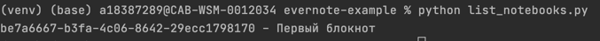
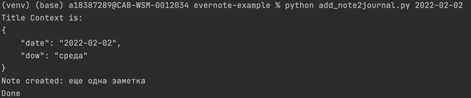
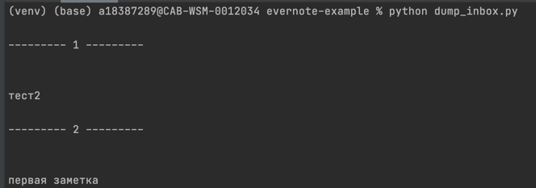

# evernote-example

## Получение доступов
- Сначала получите [Consumer Key, Consumer Secret](https://dev.evernote.com/doc/start/python.php#).
укажите `Full access`.
- После получения этих ключей, нужно получить [access token](https://dev.evernote.com/get-token/).

## Настройка окружения

- Создайте в корневом каталоге файл .env для хранения переменных окружения.
  ```
     touch .env
  ```
  и заполните его по образцу.
  ```
  EVERNOTE_CONSUMER_KEY=ваш клиентский ключ
  EVERNOTE_CONSUMER_SECRET=секретный ключ
  EVERNOTE_PERSONAL_TOKEN=S=токен доступа к апи
  JOURNAL_TEMPLATE_NOTE_GUID=шаблон guid заметки
  JOURNAL_NOTEBOOK_GUID=guid notebook
  INBOX_NOTEBOOK_GUID=входяший guid notebook
  ```
- Установить evernote-sdk для python3.
   
    - Скачайте архив из [репозитория](https://github.com/evernote/evernote-sdk-python3)
    - Перейдите в директорию sdk и установите зависимости.
   ```
    pip install -r requirements.txt
   ```
    - Установите sdk.
    ```
     python setup.py install
   ```
- Установите зависимости для работы со скриптами.
  - Перейдите снова в корневую директорию.
  - Установите зависимости (надо убрать установку evernote==1.25.3)
  ```
    pip install -r requirements.txt
   ```
## Запуск

### list_notebooks.py
Выводит guidы и названия всех блокнотов в вашем evernote.



Запустить можно командой 
 ```
     python list_notebooks.py
 ```
### add_note2journal.py
Добавляет заметку в ваш evernote. При запуске можно передать дату в качестве
параметра. Добавляет копию заметки `JOURNAL_TEMPLATE_NOTE_GUID` в указанный
блокнот `JOURNAL_NOTEBOOK_GUID`



Запустить можно командой 
 ```
     python add_note2journal.py
 ```

### dump_inbox.py
Выводит список заметок блокнота `INBOX_NOTEBOOK_GUID` (10 последних).
В качестве параметра можно указать количество заметок.



Запустить можно командой 
 ```
     python add_note2journal.py
 ```
## Замечание!
Если вы в качестве evernote и спользуете [песочницу](https://sandbox.evernote.com/)
то во всех скриптах в настройках клиента надо указать `sandbox=True`.
```python
client = EvernoteClient(
        token=config.EVERNOTE_PERSONAL_TOKEN,
        sandbox=True
    )
```
